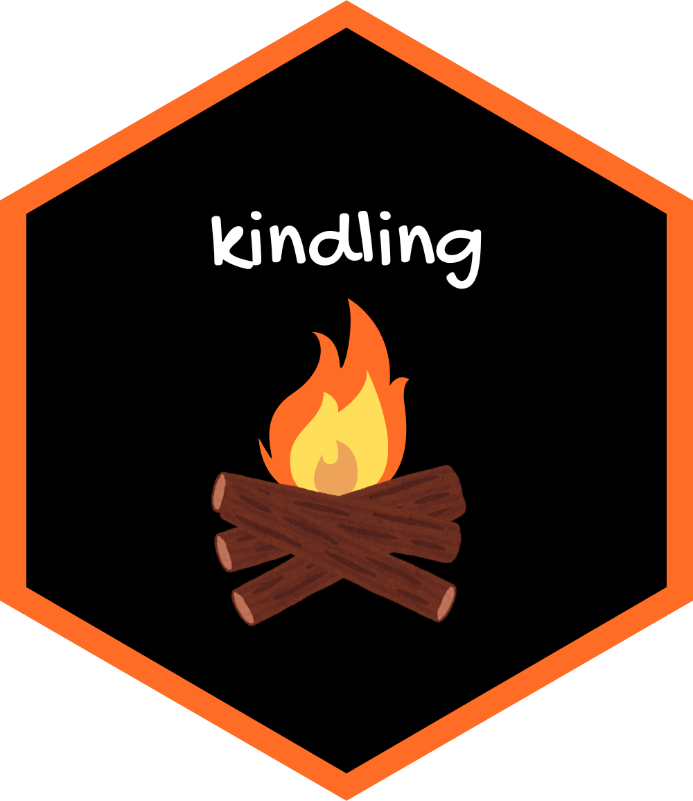

<!-- README.md is generated from README.Rmd. Please edit that file -->

```{r, include = FALSE}
knitr::opts_chunk$set(
    collapse = TRUE,
    comment = "#>",
    fig.path = "man/figures/README-",
    out.width = "100%",
    message = FALSE,
    warning = FALSE
)

desc = read.dcf("DESCRIPTION")
desc = setNames(as.list(desc), colnames(desc))
```

# `r desc$Package` 

<!-- badges: start -->
[](https://CRAN.R-project.org/package=kindling)
[](https://github.com/joshuamarie/kindling/actions/workflows/R-CMD-check.yaml)
[](https://CRAN.R-project.org/package=kindling)
<!-- [](https://CRAN.R-project.org/package=kindling) -->
[](https://app.codecov.io/gh/joshuamarie/kindling)
[](https://www.repostatus.org/#active)
<!-- badges: end -->

## Package overview

Title: ***`r desc$Title`***

Whether you're generating neural network architecture expressions or directly fitting/training models, `{kindling}` minimizes boilerplate code while preserving `{torch}`. Since this package uses `{torch}` as its backend, GPU acceleration is supported. 

`{kindling}` also bridges the gap between `{torch}` and `{tidymodels}`. It works seamlessly with `{parsnip}`, `{recipes}`, and `{workflows}` to bring deep learning into your existing `{tidymodels}` modeling pipeline. This enables a streamlined interface for building, training, and tuning deep learning models within the familiar `{tidymodels}` ecosystem.

### Main Features

<!-- -   Seamless integration with `parsnip` through `set_engine("kindling")` -->
-   Code generation of `{torch}` expression
-   Multiple architectures available

    -  Base models interface: feedforward networks (MLP/DNN/FFNN) and recurrent variants (RNN, LSTM, GRU)
    -  Generalized neural network trainer that has the same topology as MLPs

-   Native support for R ML workflows and pipelines (currently `{tidymodels}`; `{mlr3}` planned)
-   Fine-grained control over network depth, layer sizes, and activation functions
-   GPU acceleration support via `{torch}` tensors

## Installation

You can install `{kindling}` on CRAN:

``` r
install.packages('kindling')
```

Or install the development version from GitHub:

```r
# install.packages("pak")
pak::pak("joshuamarie/kindling")
## devtools::install_github("joshuamarie/kindling")
```

## Learn more

- [Getting Started with kindling](https://kindling.joshuamarie.com/articles/kindling.html)
- [Tuning Capabilities](https://kindling.joshuamarie.com/articles/tuning-capabilities.html)
- [Custom Activation Function](https://kindling.joshuamarie.com/articles/custom-act-fn.html)
- [Special Cases: Linear and Logistic Regression](https://kindling.joshuamarie.com/articles/special-cases.html)
- [Similar Packages and Comparison](https://kindling.joshuamarie.com/articles/similar-packages.html)

## References

Falbel D, Luraschi J (2023). _torch: Tensors and Neural Networks with 'GPU' Acceleration_. R package version 0.13.0, <https://torch.mlverse.org>, <https://github.com/mlverse/torch>.

Wickham H (2019). _Advanced R_, 2nd edition. Chapman and Hall/CRC. ISBN 978-0815384571, <https://adv-r.hadley.nz/>.

Goodfellow I, Bengio Y, Courville A (2016). _Deep Learning_. MIT Press. <https://www.deeplearningbook.org/>.

## Citation

If you use `{kindling}` in a publication, please cite it. Run `citation("kindling")` in R to get the current citation, or see the [CITATION file](https://github.com/joshuamarie/kindling/blob/main/inst/CITATION).

## License

MIT + file LICENSE

## Code of Conduct
  
Please note that the kindling project is released with a [Contributor Code of Conduct](https://contributor-covenant.org/version/2/1/CODE_OF_CONDUCT.html). By contributing to this project, you agree to abide by its terms.
