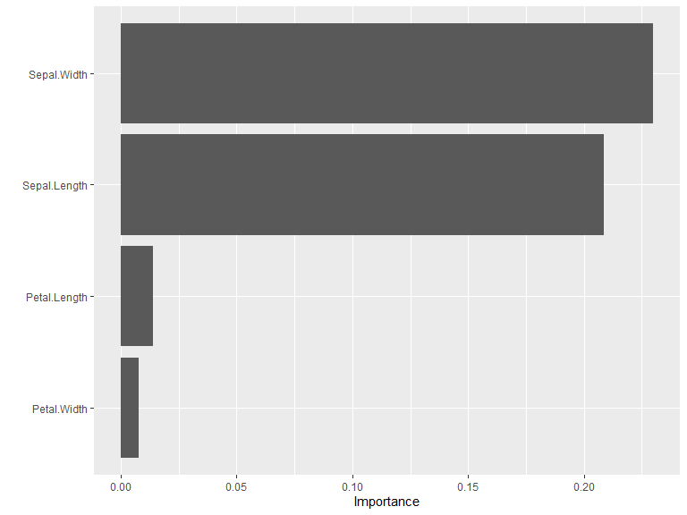

<!-- README.md is generated from README.Rmd. Please edit that file -->

# kindling 

<!-- badges: start -->

[](https://CRAN.R-project.org/package=kindling)
[](https://github.com/joshuamarie/kindling/actions/workflows/R-CMD-check.yaml)
<!-- badges: end -->

<!-- > **Note**: This package is under active development. The API may change in future versions. -->

## Package overview

Title: ***Higher-Level Interface of Torch to Auto-Train Neural
Networks***

Whether you’re generating neural network architectures expressions or
fitting/training actual models, `{kindling}` minimizes boilerplate code
while preserving `{torch}`. Since this package uses `{torch}` as its
backend, GPU/TPU devices also supported.

`{kindling}` also bridges the gap between `{torch}` and `{tidymodels}`.
It works seamlessly with `{parsnip}`, `{recipes}`, and `{workflows}` to
bring deep learning into your existing `{tidymodels}` modeling pipeline.
This enables a streamlined interface for building, training, and tuning
deep learning models within the familiar `{tidymodels}` ecosystem.

### Main Features

<!-- -   Seamless integration with `parsnip` through `set_engine("kindling")` -->

- Code generation of `{torch}` expression
- Multiple architectures available: feedforward networks (MLP/DNN/FFNN)
  and recurrent variants (RNN, LSTM, GRU)
- Native support for `{tidymodels}` workflows and pipelines
- Fine-grained control over network depth, layer sizes, and activation
  functions
- GPU acceleration supports via `{torch}` tensors
  <!-- -   Dramatically less boilerplate than raw `{torch}` implementations -->

### Supported Architectures (As of now)

- **Feedforward Networks (DNN/FFNN)**: Classic multi-layer perceptrons
  for tabular data and general supervised learning
- **Recurrent Neural Networks (RNN)**: Basic recurrent architecture for
  sequential patterns
- **Long Short-Term Memory (LSTM)**: Sophisticated recurrent networks
  with gating mechanisms for long-range dependencies
- **Gated Recurrent Units (GRU)**: Streamlined alternative to LSTM with
  fewer parameters

## Installation

You can install `{kindling}` on CRAN:

``` r
install.packages('kindling')
```

Or install the development version from GitHub:

``` r
# install.packages("pak")
pak::pak("joshuamarie/kindling")
```

## Usage: Three Levels of Interaction

`{kindling}` is powered by R’s metaprogramming capabilities through
*code generation*. Generated `torch::nn_module` expressions power the
training functions, which in turn serve as engines for `{tidymodels}`
integration. This architecture gives you flexibility to work at whatever
abstraction level suits your task.

``` r
library(kindling)
#> 
#> Attaching package: 'kindling'
#> The following object is masked from 'package:base':
#> 
#>     args
```

### Level 1: Code Generation for `torch::nn_module`

At the lowest level, you can generate raw `torch::nn_module` code for
maximum customization. Functions ending with `_generator` return
unevaluated expressions you can inspect, modify, or execute.

Here’s how to generate a feedforward network specification:

``` r
ffnn_generator(
    nn_name = "MyFFNN",
    hd_neurons = c(64, 32, 16),
    no_x = 10,
    no_y = 1,
    activations = 'relu'
)
#> torch::nn_module("MyFFNN", initialize = function () 
#> {
#>     self$fc1 = torch::nn_linear(10, 64, bias = TRUE)
#>     self$fc2 = torch::nn_linear(64, 32, bias = TRUE)
#>     self$fc3 = torch::nn_linear(32, 16, bias = TRUE)
#>     self$out = torch::nn_linear(16, 1, bias = TRUE)
#> }, forward = function (x) 
#> {
#>     x = self$fc1(x)
#>     x = torch::nnf_relu(x)
#>     x = self$fc2(x)
#>     x = torch::nnf_relu(x)
#>     x = self$fc3(x)
#>     x = torch::nnf_relu(x)
#>     x = self$out(x)
#>     x
#> })
```

This creates a three-hidden-layer network (64 - 32 - 16 neurons) that
takes 10 inputs and produces 1 output. Each hidden layer uses ReLU
activation, while the output layer remains “untransformed”.

### Level 2: Direct Training Interface

Skip the code generation and train models directly with your data. This
approach handles all the `{torch}` boilerplate when training the models
internally.

Let’s classify iris species:

``` r
model = ffnn(
    Species ~ .,
    data = iris,
    hidden_neurons = c(10, 15, 7),
    activations = act_funs(relu, softshrink = args(lambd = 0.5), elu), 
    loss = "cross_entropy",
    epochs = 100
)

model
```


    ======================= Feedforward Neural Networks (MLP) ======================


    -- FFNN Model Summary ----------------------------------------------------------

        -----------------------------------------------------------------------
          NN Model Type           :             FFNN    n_predictors :      4
          Number of Epochs        :              100    n_response   :      3
          Hidden Layer Units      :        10, 15, 7    reg.         :   None
          Number of Hidden Layers :                3    Device       :    cpu
          Pred. Type              :   classification                 :       
        -----------------------------------------------------------------------


    -- Activation function ---------------------------------------------------------

                   -------------------------------------------------
                     1st Layer {10}    :                      relu
                     2nd Layer {15}    :   softshrink(lambd = 0.5)
                     3rd Layer {7}     :                       elu
                     Output Activation :   No act function applied
                   -------------------------------------------------

Evaluate the prediction through `predict()`. The `predict()` method is
extended for fitted models through its `newdata` argument.

Two kinds of `predict()` usage:

1.  **Without `newdata`** predictions is the default to the parent data
    frame.

    ``` r
    predict(model) |>
        (\(x) table(actual = iris$Species, predicted = x))()
    #>             predicted
    #> actual       setosa versicolor virginica
    #>   setosa         50          0         0
    #>   versicolor      0         47         3
    #>   virginica       0          1        49
    ```

2.  **With `newdata`** simply pass the new data frame as the new
    reference.

    ``` r
    sample_iris = dplyr::slice_sample(iris, n = 10, by = Species)

    predict(model, newdata = sample_iris) |>
        (\(x) table(actual = sample_iris$Species, predicted = x))()
    #>             predicted
    #> actual       setosa versicolor virginica
    #>   setosa         10          0         0
    #>   versicolor      0          9         1
    #>   virginica       0          0        10
    ```

### Level 3: Conventional tidymodels Integration

Work with neural networks just like any other `{parsnip}` model. This
unlocks the entire `{tidymodels}` toolkit for preprocessing,
cross-validation, and model evaluation.

``` r
# library(kindling)
# library(parsnip)
# library(yardstick)
box::use(
    kindling[mlp_kindling, rnn_kindling, act_funs, args],
    parsnip[fit, augment],
    yardstick[metrics],
    mlbench[Ionosphere] # data(Ionosphere, package = "mlbench")
)

ionosphere_data = Ionosphere[, -2]

# Train a feedforward network with parsnip
mlp_kindling(
    mode = "classification",
    hidden_neurons = c(128, 64),
    activations = act_funs(relu, softshrink = args(lambd = 0.5)),
    epochs = 100
) |>
    fit(Class ~ ., data = ionosphere_data) |>
    augment(new_data = ionosphere_data) |>
    metrics(truth = Class, estimate = .pred_class)
#> # A tibble: 2 × 3
#>   .metric  .estimator .estimate
#>   <chr>    <chr>          <dbl>
#> 1 accuracy binary         0.989
#> 2 kap      binary         0.975

# Or try a recurrent architecture (demonstrative example with tabular data)
rnn_kindling(
    mode = "classification",
    hidden_neurons = c(128, 64),
    activations = act_funs(relu, elu),
    epochs = 100,
    rnn_type = "gru"
) |>
    fit(Class ~ ., data = ionosphere_data) |>
    augment(new_data = ionosphere_data) |>
    metrics(truth = Class, estimate = .pred_class)
#> # A tibble: 2 × 3
#>   .metric  .estimator .estimate
#>   <chr>    <chr>          <dbl>
#> 1 accuracy binary         0.641
#> 2 kap      binary         0
```

## Hyperparameter Tuning & Resampling

<!-- > This functionality is available, but still not fully optimized. -->

The package has integration with `{tidymodels}`, so it supports
hyperparameter tuning via `{tune}` with searchable parameters.

The current searchable parameters under `{kindling}`:

- Layer widths (neurons per layer)
- Network depth (number of hidden layers - coming soon)
- Activation function combinations
- Output activation
- Optimizer (Type of optimization algorithm)
- Bias (choose between the presence and the absence of the bias term)
- Validation Split Proportion
- Bidirectional (boolean; only for RNN)

The searchable parameters outside from `{kindling}`, i.e. under
`{dials}` package such as `learn_rate()` also supported.

Here’s an example:

``` r
box::use(
    kindling[
        mlp_kindling, hidden_neurons, activations, output_activation, grid_depth
    ],
    parsnip[fit, augment],
    recipes[recipe],
    workflows[workflow, add_recipe, add_model],
    rsample[vfold_cv],
    tune[tune_grid, tune, select_best, finalize_workflow],
    dials[grid_random],
    yardstick[accuracy, roc_auc, metric_set, metrics]
)

mlp_tune_spec = mlp_kindling(
    mode = "classification",
    hidden_neurons = tune(),
    activations = tune(),
    output_activation = tune()
)

iris_folds = vfold_cv(iris, v = 3)
nn_wf = workflow() |>
    add_recipe(recipe(Species ~ ., data = iris)) |>
    add_model(mlp_tune_spec)

nn_grid_depth = grid_depth(
    hidden_neurons(c(32L, 128L)),
    activations(c("relu", "elu")),
    output_activation(c("sigmoid", "linear")),
    n_hlayer = 2,
    size = 10,
    type = "latin_hypercube"
)

# This is supported but limited to 1 hidden layer only
## nn_grid = grid_random(
##     hidden_neurons(c(32L, 128L)),
##     activations(c("relu", "elu")),
##     output_activation(c("sigmoid", "linear")),
##     size = 10
## )

nn_tunes = tune::tune_grid(
    nn_wf,
    iris_folds,
    grid = nn_grid_depth
    # metrics = metric_set(accuracy, roc_auc)
)

best_nn = select_best(nn_tunes)
final_nn = finalize_workflow(nn_wf, best_nn)
# Last run: 4 - 91 (relu) - 3 (sigmoid) units
final_nn_model = fit(final_nn, data = iris)

final_nn_model |>
    augment(new_data = iris) |>
    metrics(truth = Species, estimate = .pred_class)
#> # A tibble: 2 × 3
#>   .metric  .estimator .estimate
#>   <chr>    <chr>          <dbl>
#> 1 accuracy multiclass     0.667
#> 2 kap      multiclass     0.5
```

Resampling strategies from `{rsample}` will enable robust
cross-validation workflows, orchestrated through the `{tune}` and
`{dials}` APIs.

## Variable Importance

`{kindling}` integrates with established variable importance methods
from `{NeuralNetTools}` and `{vip}` to interpret trained neural
networks. Two primary algorithms are available:

1.  Garson’s Algorithm

    ``` r
    garson(model, bar_plot = FALSE)
    #>        x_names y_names  rel_imp
    #> 1  Sepal.Width Species 28.02159
    #> 2 Petal.Length Species 26.55890
    #> 3  Petal.Width Species 24.75992
    #> 4 Sepal.Length Species 20.65959
    ```

2.  Olden’s Algorithm

    ``` r
    olden(model, bar_plot = FALSE)
    #>        x_names y_names    rel_imp
    #> 1  Petal.Width Species  0.7488315
    #> 2  Sepal.Width Species -0.5967398
    #> 3 Petal.Length Species  0.4686559
    #> 4 Sepal.Length Species -0.3131365
    ```

### Integration with {vip}

For users working within the `{tidymodels}` ecosystem, `{kindling}`
models work seamlessly with the `{vip}` package:

``` r
box::use(
    vip[vi, vip]
)

vi(model) |> 
    vip()
```



*Note: Weight caching increases memory usage proportional to network
size. Only enable it when you plan to compute variable importance
multiple times on the same model.*

## References

Falbel D, Luraschi J (2023). *torch: Tensors and Neural Networks with
‘GPU’ Acceleration*. R package version 0.13.0,
<https://torch.mlverse.org>, <https://github.com/mlverse/torch>.

Wickham H (2019). *Advanced R*, 2nd edition. Chapman and Hall/CRC. ISBN
978-0815384571, <https://adv-r.hadley.nz/>.

Goodfellow I, Bengio Y, Courville A (2016). *Deep Learning*. MIT Press.
<https://www.deeplearningbook.org/>.

## License

MIT + file LICENSE

## Code of Conduct

Please note that the kindling project is released with a [Contributor
Code of
Conduct](https://contributor-covenant.org/version/2/1/CODE_OF_CONDUCT.html).
By contributing to this project, you agree to abide by its terms.
