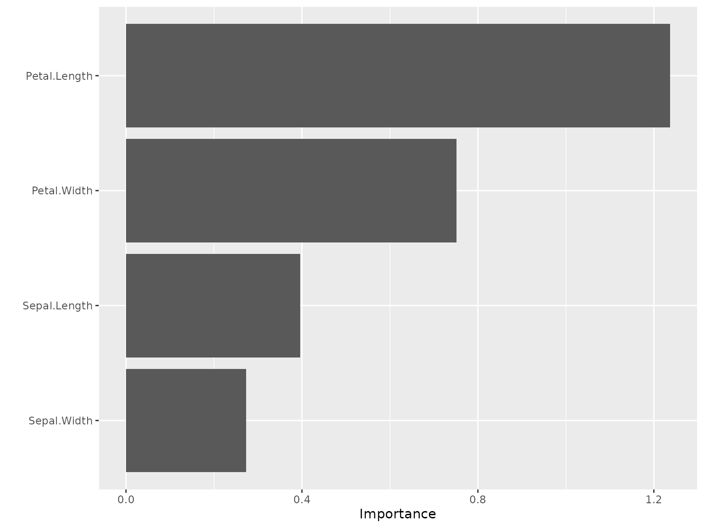

# Getting Started with kindling

## Introduction

[kindling](https://kindling.joshuamarie.com) bridges the gap between
[torch](https://torch.mlverse.org/docs) and
[tidymodels](https://tidymodels.tidymodels.org), providing a streamlined
interface for building, training, and tuning deep learning models. This
vignette will guide you through the basic usage.

## Installation

You can install [kindling](https://kindling.joshuamarie.com) on CRAN:

``` r

install.packages('kindling')
```

Or install the development version from GitHub:

``` r

# install.packages("pak")
pak::pak("joshuamarie/kindling")
## devtools::install_github("joshuamarie/kindling") 
```

## Before using {kindling}

``` r

library(kindling)
```

Before starting, you need to install LibTorch first, the backend of
PyTorch, which is also the backend of
[torch](https://torch.mlverse.org/docs) R package:

``` r

torch::install_torch()
```

## Main Features

Current [kindling](https://kindling.joshuamarie.com) supports the
following:

- Code generation of [torch](https://torch.mlverse.org/docs) expression

- Multiple architectures available

  - Base models interface: feedforward networks (MLP/DNN/FFNN) and
    recurrent variants (RNN, LSTM, GRU)
  - Generalized neural network trainer that has the same topology as
    MLPs

- Native support for R ML workflows and pipelines (currently
  [tidymodels](https://tidymodels.tidymodels.org);
  [mlr3](https://mlr3.mlr-org.com) planned)

- Fine-grained control over network depth, layer sizes, and activation
  functions

- GPU acceleration support via [torch](https://torch.mlverse.org/docs)
  tensors

### What it doesn’t support

As of [kindling](https://kindling.joshuamarie.com) \>0.3.0, it supports
most of NN architectures thanks to its versatility, as long as they
follow typical MLP’s topology. This package, however, does not support
the following:

1.  Residual Networks (ResNet)
2.  Automatic Integration (AutoInt)
3.  Self-Attention and Inter-sample Attention Transformer (Saint)

To use all of these, you might want to take an interest towards
[brulee](https://github.com/tidymodels/brulee) package instead. The said
NN architectures above are available on version 1.0.0 (and later)
release.

## Usage: Three Levels of Interaction

[kindling](https://kindling.joshuamarie.com) is powered by R’s
metaprogramming capabilities through *code generation*. Generated
[`torch::nn_module()`](https://torch.mlverse.org/docs/reference/nn_module.html)
expressions power the training functions, which in turn serve as engines
for [tidymodels](https://tidymodels.tidymodels.org) integration. This
architecture gives you flexibility to work at whatever abstraction level
suits your task.

### Level 1: Code Generation for `torch::nn_module`

At the lowest level, you can generate raw
[`torch::nn_module`](https://torch.mlverse.org/docs/reference/nn_module.html)
code for maximum customization. Functions ending with `_generator`
return unevaluated expressions you can inspect, modify, or execute.

Here’s how to generate a feedforward network specification:

``` r

ffnn_generator(
    nn_name = "MyFFNN",
    hd_neurons = c(64, 32, 16),
    no_x = 10,
    no_y = 1,
    activations = 'relu'
)
```

    torch::nn_module("MyFFNN", initialize = function () 
    {
        self$fc1 = torch::nn_linear(10, 64, bias = TRUE)
        self$fc2 = torch::nn_linear(64, 32, bias = TRUE)
        self$fc3 = torch::nn_linear(32, 16, bias = TRUE)
        self$out = torch::nn_linear(16, 1, bias = TRUE)
    }, forward = function (x) 
    {
        x = self$fc1(x)
        x = torch::nnf_relu(x)
        x = self$fc2(x)
        x = torch::nnf_relu(x)
        x = self$fc3(x)
        x = torch::nnf_relu(x)
        x = self$out(x)
        x
    })

This creates a three-hidden-layer network (64 - 32 - 16 neurons) that
takes 10 inputs and produces 1 output. Each hidden layer uses ReLU
activation, while the output layer remains “untransformed”.

### Level 2: Direct Training Interface

Skip the code generation and train models directly with your data. This
approach handles all the [torch](https://torch.mlverse.org/docs)
boilerplate when training the models internally.

Let’s classify iris species:

``` r

model = ffnn(
    Species ~ .,
    data = iris,
    hidden_neurons = c(10, 15, 7),
    activations = act_funs(relu, softshrink[lambd = 0.5], elu), 
    loss = "cross_entropy",
    epochs = 100
)

model
```

``` fansi

======================= Feedforward Neural Networks (MLP) ======================


-- FFNN Model Summary ----------------------------------------------------------
```

``` fansi
-----------------------------------------------------------------------
  NN Model Type           :             FFNN    n_predictors :      4
  Number of Epochs        :              100    n_response   :      3
  Hidden Layer Units      :        10, 15, 7    reg.         :   None
  Number of Hidden Layers :                3    Device       :    cpu
  Pred. Type              :   classification                 :       
-----------------------------------------------------------------------


-- Activation function ---------------------------------------------------------
```

    -------------------------------------------------
      1st Layer {10}    :                      relu
      2nd Layer {15}    :   softshrink(lambd = 0.5)
      3rd Layer {7}     :                       elu
      Output Activation :   No act function applied
    -------------------------------------------------

> For parametric activation functions like softshrink, which contains
> `"lambd"` (\lambda) as its parameter (the default is 1), use indexed
> syntax (available on v0.3.x+) e.g. `softshrink[lambd = 0.5]` or
> `softshrink[0.5]`, or a string literal expression
> e.g. `"softshrink(lambd = 0.5)"`, to transmute the parameter value.
> See `?kindling::act_funs()` for more details.

Evaluate the prediction through
[`predict()`](https://rdrr.io/r/stats/predict.html). The
[`predict()`](https://rdrr.io/r/stats/predict.html) method is extended
for fitted models through its `newdata` argument.

Two kinds of [`predict()`](https://rdrr.io/r/stats/predict.html) usage:

1.  **Without `newdata`** predictions default to the training data.

    ``` r

    predict(model) |>
        (\(x) table(actual = iris$Species, predicted = x))()
    #>             predicted
    #> actual       setosa versicolor virginica
    #>   setosa         50          0         0
    #>   versicolor      0         48         2
    #>   virginica       0          2        48
    ```

2.  **With `newdata`** simply pass the new data frame as the new
    reference.

    ``` r

    sample_iris = dplyr::slice_sample(iris, n = 10, by = Species)

    predict(model, newdata = sample_iris) |>
        (\(x) table(actual = sample_iris$Species, predicted = x))()
    #>             predicted
    #> actual       setosa versicolor virginica
    #>   setosa         10          0         0
    #>   versicolor      0          8         2
    #>   virginica       0          2         8
    ```

### Level 3: Conventional tidymodels Integration

Work with neural networks just like any other
[parsnip](https://github.com/tidymodels/parsnip) model. This unlocks the
entire [tidymodels](https://tidymodels.tidymodels.org) toolkit for
preprocessing, cross-validation, and model evaluation.

``` r

# library(kindling)
# library(parsnip)
# library(yardstick)
box::use(
    kindling[mlp_kindling, rnn_kindling, act_funs, args],
    parsnip[fit, augment],
    yardstick[metrics]
)
data(Ionosphere, package = "mlbench")

ionosphere_data = Ionosphere[, -2]

# Train a feedforward network with parsnip
mlp_kindling(
    mode = "classification",
    hidden_neurons = c(128, 64),
    activations = act_funs(relu, softshrink[lambd = 0.5]),
    epochs = 100
) |>
    fit(Class ~ ., data = ionosphere_data) |>
    augment(new_data = ionosphere_data) |>
    metrics(truth = Class, estimate = .pred_class)
```

``` fansi
#> # A tibble: 2 × 3
#>   .metric  .estimator .estimate
#>   <chr>    <chr>          <dbl>
#> 1 accuracy binary         0.989
#> 2 kap      binary         0.975
```

``` r


# Or try a recurrent architecture (demonstrative example with tabular data)
rnn_kindling(
    mode = "classification",
    hidden_neurons = c(128, 64),
    activations = act_funs(relu, elu),
    epochs = 100,
    rnn_type = "gru"
) |>
    fit(Class ~ ., data = ionosphere_data) |>
    augment(new_data = ionosphere_data) |>
    metrics(truth = Class, estimate = .pred_class)
```

``` fansi
#> # A tibble: 2 × 3
#>   .metric  .estimator .estimate
#>   <chr>    <chr>          <dbl>
#> 1 accuracy binary             1
#> 2 kap      binary             1
```

## Hyperparameter Tuning & Resampling

The package has integration with
[tidymodels](https://tidymodels.tidymodels.org), so it supports
hyperparameter tuning via [tune](https://tune.tidymodels.org/) with
searchable parameters.

The current searchable parameters under
[kindling](https://kindling.joshuamarie.com):

- Layer widths (neurons per layer)
- Network depth (number of hidden layers)
- Activation function combinations
- Output activation
- Optimizer (Type of optimization algorithm)
- Bias (choose between the presence and the absence of the bias term)
- Validation Split Proportion
- Bidirectional (boolean; only for RNN)

The searchable parameters outside from
[kindling](https://kindling.joshuamarie.com), i.e. under
[dials](https://dials.tidymodels.org) package such as
[`learn_rate()`](https://dials.tidymodels.org/reference/learn_rate.html)
also supported.

Here’s an example:

``` r

# library(tidymodels)
box::use(
    kindling[
        mlp_kindling, hidden_neurons, activations, output_activation, grid_depth
    ],
    parsnip[fit, augment],
    recipes[recipe],
    workflows[workflow, add_recipe, add_model],
    rsample[vfold_cv],
    tune[tune_grid, tune, select_best, finalize_workflow],
    dials[grid_random],
    yardstick[accuracy, roc_auc, metric_set, metrics]
)

mlp_tune_spec = mlp_kindling(
    mode = "classification",
    hidden_neurons = tune(),
    activations = tune(),
    output_activation = tune()
)

iris_folds = vfold_cv(iris, v = 3)
nn_wf = workflow() |>
    add_recipe(recipe(Species ~ ., data = iris)) |>
    add_model(mlp_tune_spec)

nn_grid_depth = grid_depth(
    hidden_neurons(c(32L, 128L)),
    activations(c("relu", "elu")),
    output_activation(c("sigmoid", "linear")),
    n_hlayer = 2,
    size = 10,
    type = "latin_hypercube"
)

# This is supported but limited to 1 hidden layer only
## nn_grid = grid_random(
##     hidden_neurons(c(32L, 128L)),
##     activations(c("relu", "elu")),
##     output_activation(c("sigmoid", "linear")),
##     size = 10
## )

nn_tunes = tune::tune_grid(
    nn_wf,
    iris_folds,
    grid = nn_grid_depth
)

best_nn = select_best(nn_tunes)
best_nn
```

``` fansi
# A tibble: 1 × 4
  hidden_neurons activations output_activation .config         
  <list>         <list>      <chr>             <chr>           
1 <int [2]>      <chr [2]>   sigmoid           pre0_mod02_post0
```

``` r

final_nn = finalize_workflow(nn_wf, best_nn)
final_nn_model = fit(final_nn, data = iris)
final_nn_model
```

``` fansi
══ Workflow [trained] ══════════════════════════════════════════════════════════
Preprocessor: Recipe
Model: mlp_kindling()

── Preprocessor ────────────────────────────────────────────────────────────────
0 Recipe Steps

── Model ───────────────────────────────────────────────────────────────────────
```

``` fansi

======================= Feedforward Neural Networks (MLP) ======================


-- FFNN Model Summary ----------------------------------------------------------
```

``` fansi
-----------------------------------------------------------------------
  NN Model Type           :             FFNN    n_predictors :      4
  Number of Epochs        :              100    n_response   :      3
  Hidden Layer Units      :          50, 101    reg.         :   None
  Number of Hidden Layers :                2    Device       :    cpu
  Pred. Type              :   classification                 :       
-----------------------------------------------------------------------


-- Activation function ---------------------------------------------------------
```

    ---------------------------------
      1st Layer {50}    :       elu
      2nd Layer {101}   :       elu
      Output Activation :   sigmoid
    ---------------------------------

``` r

final_nn_model |>
    augment(new_data = iris) |>
    metrics(truth = Species, estimate = .pred_class)
```

``` fansi
# A tibble: 2 × 3
  .metric  .estimator .estimate
  <chr>    <chr>          <dbl>
1 accuracy multiclass     0.667
2 kap      multiclass     0.5  
```

Resampling strategies from [rsample](https://rsample.tidymodels.org)
will enable robust cross-validation workflows, orchestrated through the
[tune](https://tune.tidymodels.org/) and
[dials](https://dials.tidymodels.org) APIs.

## Variable Importance

[kindling](https://kindling.joshuamarie.com) integrates with established
variable importance methods from `{NeuralNetTools}` and
[vip](https://github.com/koalaverse/vip/) to interpret trained neural
networks. Two primary algorithms are available:

1.  Garson’s Algorithm

    ``` r

    garson(model, bar_plot = FALSE)
    #>        x_names y_names  rel_imp
    #> 1 Petal.Length       y 33.10453
    #> 2 Sepal.Length       y 25.54733
    #> 3  Petal.Width       y 23.22710
    #> 4  Sepal.Width       y 18.12104
    ```

2.  Olden’s Algorithm

    ``` r

    olden(model, bar_plot = FALSE)
    #>        x_names y_names    rel_imp
    #> 1 Petal.Length       y  1.2369109
    #> 2  Petal.Width       y  0.7515944
    #> 3 Sepal.Length       y -0.3963223
    #> 4  Sepal.Width       y -0.2736251
    ```

### Integration with {vip}

For users working within the
[tidymodels](https://tidymodels.tidymodels.org) ecosystem,
[kindling](https://kindling.joshuamarie.com) models work seamlessly with
the [vip](https://github.com/koalaverse/vip/) package:

``` r

box::use(
    vip[vi, vip]
)

vi(model) |> 
    vip()
```



*Note: Weight caching increases memory usage proportional to network
size. Only enable it when you plan to compute variable importance
multiple times on the same model.*

## Learn More

- Visit the package website: <https://kindling.joshuamarie.com>
- Report issues: <https://github.com/joshuamarie/kindling/issues>
